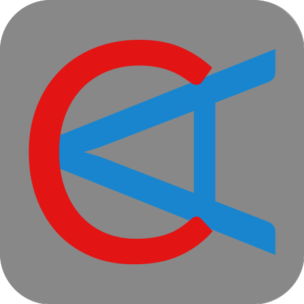
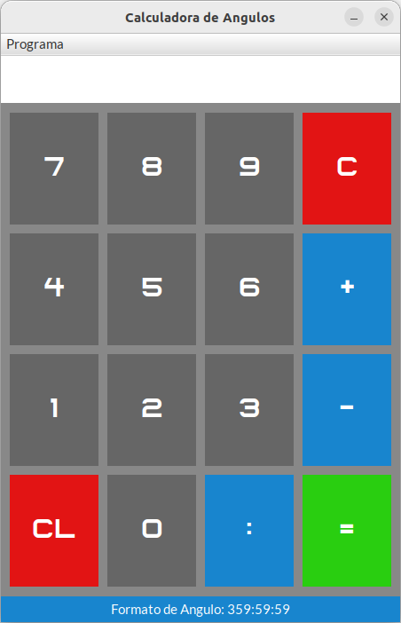
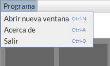
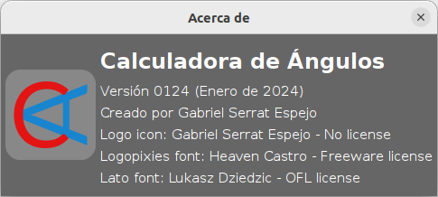
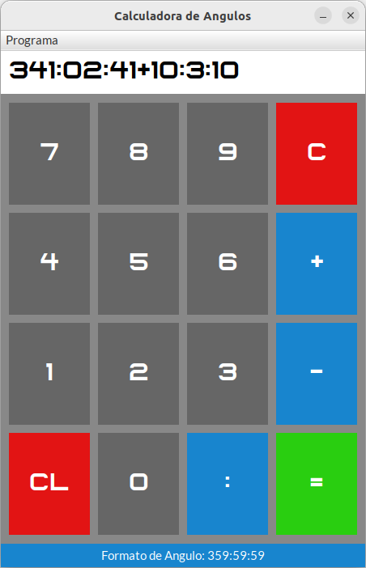
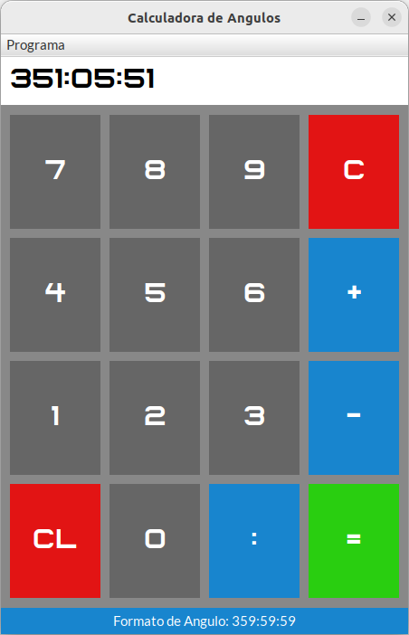

# Calculadora_de_Angulos
App de calculadora de angulos hecha en Java y Swing

## Descripción

Una aplicación básica de una calculadora de angulos.

Permite hacer operaciones de sumar (+) y restar (-) un maximo de 2 grados a la vez. (Ejemplo: 234:12:33 + 037:58:01).

El formato númerico de un angulo son GGG:MM:SS (Grados, Minutos y Segundos).

Este formato empieza en 000:00:00 hasta 359:59:59.

## Funcionamiento

### Ventana principal

La ventana principal dispone de 2 apartados interactivos:

#### Pantalla superior y botones

El rectangulo superior blanco muestra tanto los angulos a escribir como el resultado de la operación.

Puedes escribir con los botones de la ventana o tu teclado fisico.

##### Descripcion de los botones

- **0 - 9**: Números para escribir angulos.
- **+** : Sumar 2 angulos (escribir antes del segundo angulo).
- **-** : Restar 2 angulos (escribir antes del segundo angulo).
- **:** : Separador de angulos (minimo 0, maximo 2 separadores por angulo. Ejemplo: 30 o 30:30 o 30:30:30).
- **=** : Realizar la operación final. Despues de la operación, puedes volver a hacer otra operación utilizando el resultado anterior.
- **C** : Borrar la pantalla superior.
- **CL** : Borrar el ultimo caracter de la pantalla superior.

#### Menu de navegación 'Programa'

Menú de navegación con 3 opciones:

- **Ctrl+N** : Abrir una nueva ventana independiente.
- **Ctrl+A** : Abrir una ventana de Acerca del programa.
- **Ctrl+Q** : Cerrar la ventana.

### Muestra de operación

El programa permite un máximo de 2 angulos a sumar o restar a la vez.

El maximo de separadores por angulo es 2. Tambien puedes hacer operaciones de números simples (Ejemplo: 23 - 9).

Una vez pulsado en boton verde o escrito el simbolo **=**, la operación se ejecuta.

El resultado de la operación permite volver a hacer otra operación a partir del resultado anterior.

## Agradecimientos

- **Calculadora de Angulos (Logotipo)** : Creado por Gabriel Serrat Espejo (yo).
- **Logopixies Font** : Creado por Heaven Castro. Freeware Licence. [logopixies font link](https://www.fontspace.com/logopixies-font-f40772). [info.txt](src/grafica/assets/logopixies/info.txt).
- **Lato Font** : Creado por [yPoland Lukasz Dziedzic](mailto:team@latofonts.com). [OFL License v1.1 (26/02/2007)](src/grafica/assets/lato/OFL.txt).
